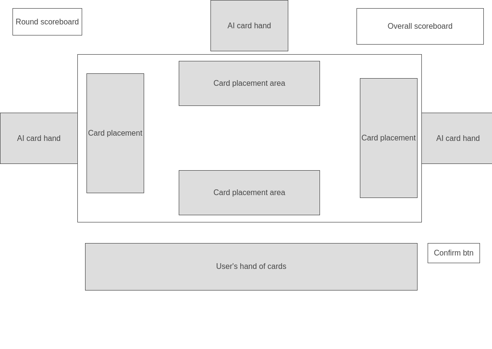

# Background and Overview
This is a javascript applicaiton that is an application of the Chinese card playing game "tractor" otherwise also known as "finding friends"/"zhao peng you".

Detailed rule explainations can be found here: https://en.wikipedia.org/wiki/Sheng_ji

# Functionality and MVPs
- [ ] A user along with 3 ai players.
- [ ] 2 decks of cards that will be distributed among 4 players with 8 cards left as a vault
- [ ] Players being able to play singles, doubles, or tractors 
- [ ] Game logic is able to handle point scoring, trump cards and round winners
- [ ] Auto sorting a player's hand

### In addition, this project will include:
- [ ] playing with other simulated players
- [ ] unique rules such as hooking a team when they are at Jack

# Wireframes and file structure
Game board

/src 
* /assets
    - card_images.png
    - suites.png
* index.js
* /js
    - cards.js
    - users.js
    - board.js
    - util.js
    - game.js
    - scoreboard.js

# Architecture and Technology
 - Deck of Cards API used to simulate drawing from multiple decks of cards and show their image.
- Dom manipulation to handle game animation.

# Implementation Timeline
### Monday
- implement deck of cards api to draw and shuffle 2 decks of cards
- incorporate clean card draw animation
- determine host
### Tuesday
- implement one round of game logic
- determine who a winner of a round is
- determine valid cards a user is able to play
### Wednesday
- implement round transitions from one round to another
- score points for round winner if they are not host
### Thursday 
- render error messages for invalid plays
- incorporate special rules such as no trump roudns.